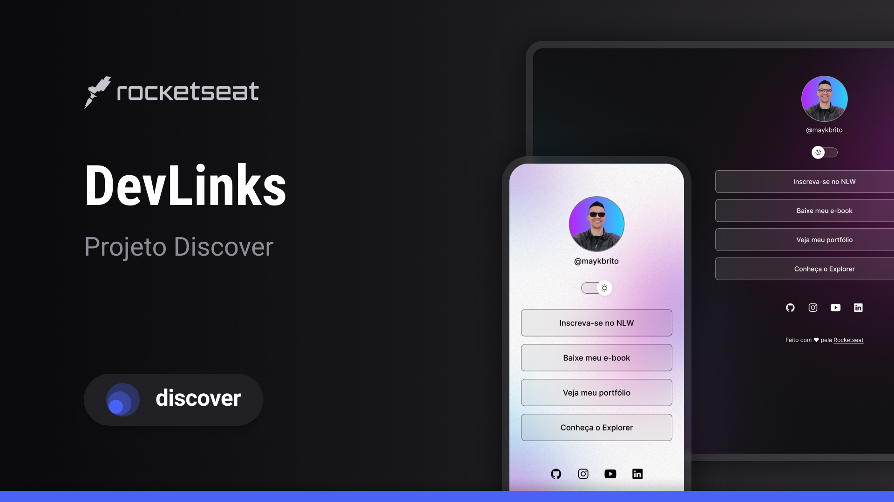

<h1 align="center"> DevLinks project </h1>

Evento exclusivo e gratuito, promovido pela Rocketseat para ensino de tecnologias WEB.

  <a href="#-tecnologias">Tecnologias</a>&nbsp;&nbsp;&nbsp;|&nbsp;&nbsp;&nbsp;
  <a href="#-projeto">Projeto</a>&nbsp;&nbsp;&nbsp;|&nbsp;&nbsp;&nbsp;
  <a href="#-layout">Layout</a>&nbsp;&nbsp;&nbsp;|&nbsp;&nbsp;&nbsp;
  <a href="#memo-licença">Licença</a>

  

## 🚀 Tecnologias

- HTML e CSS
- JavaScript
- Git e Github
- Figma

## 💻 Projeto

DevLinks é um biosite simples e prático desenvolvido com intuito de iniciar a prática nas tecnologias utilizadas.

## 🔖 Layout

Você pode visualizar o layout do projeto através [DESSE LINK](<https://www.figma.com/file/M7WNiCfswcaJK5HfwvtI1W/DevLinks-%E2%80%A2-Projeto-Discover-(Community)?type=design&node-id=1437%3A191&mode=dev>). É necessário ter conta no [Figma](https://figma.com) para acessá-lo.

## 📝 Licença

Esse projeto está sob a licença MIT.

---

Feito com ♥ by DocX/Rocketseat. [Participe da nossa comunidade!](https://discord.gg/rocketseat)
